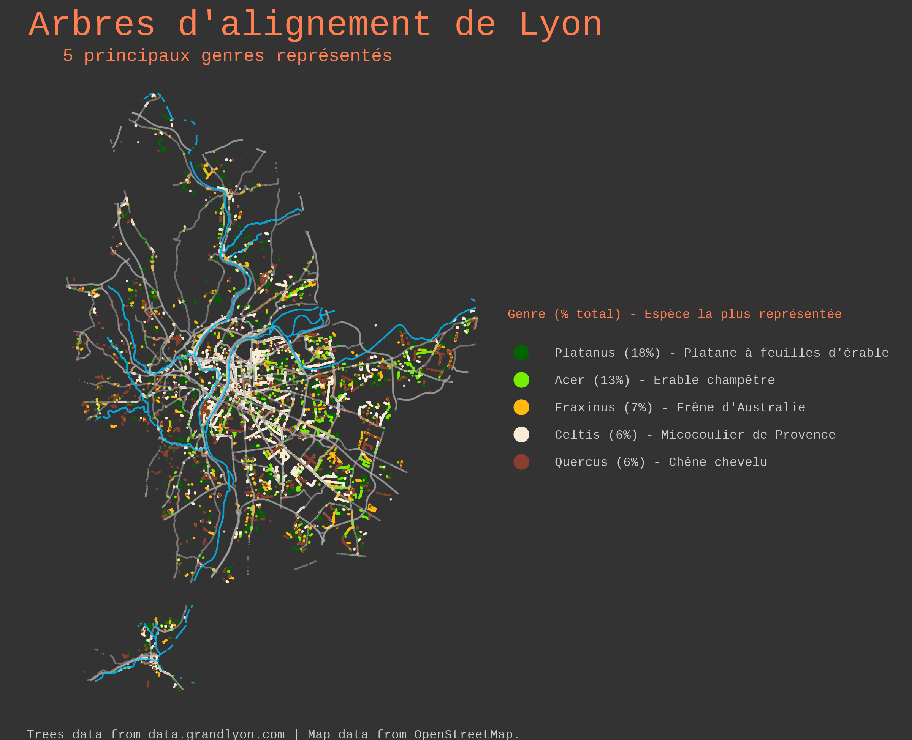
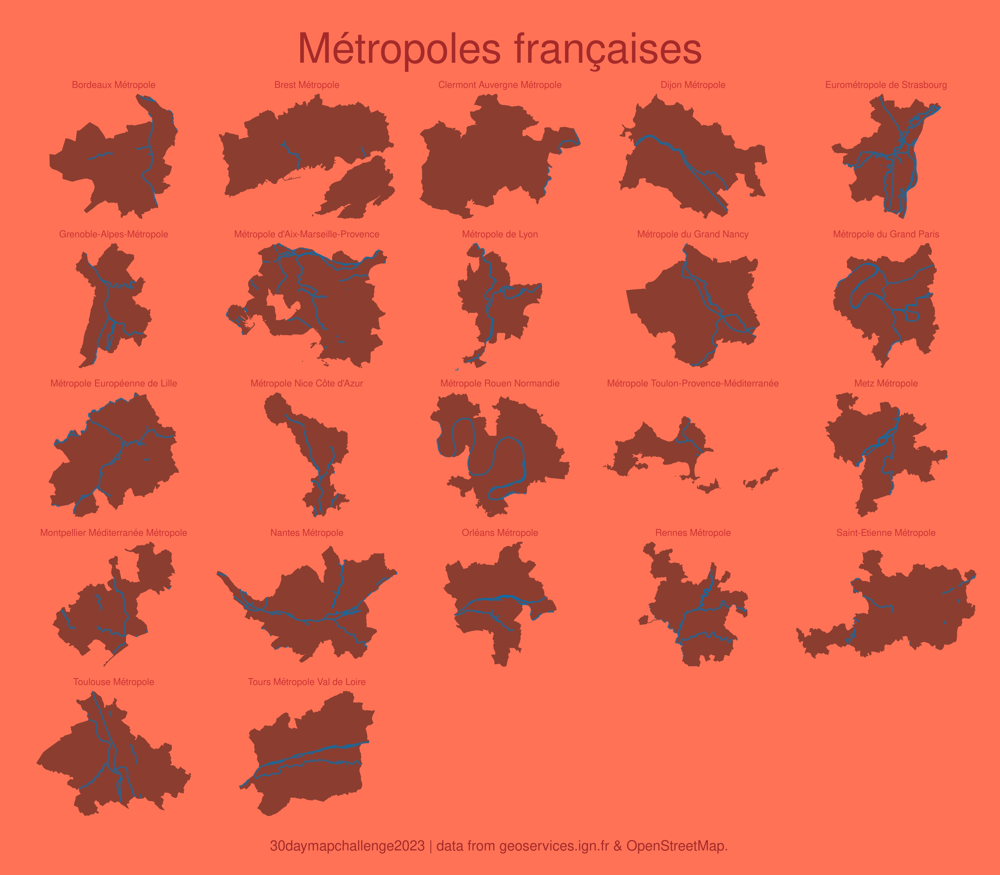
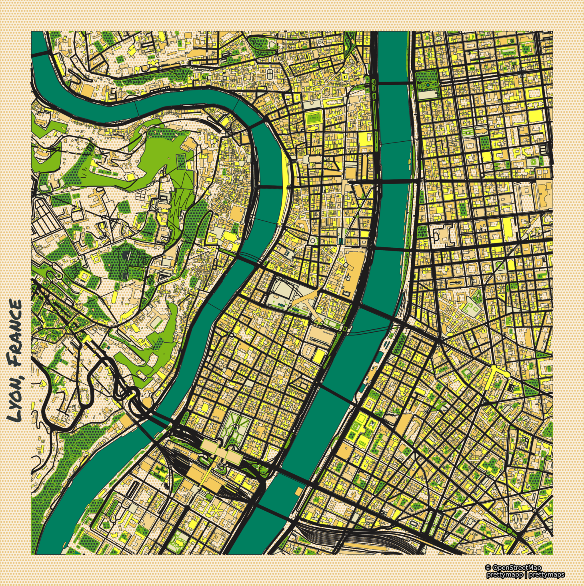

# #30DayMapChallenge 2023

Le #30DayMapChallenge est un défi lancé la première fois en 2019 par [Topi Tjukanov](https://tjukanov.org/aboutme) dont l'idée est de créer et partager une carte chaque jour pendant 30 jours, avec un thème imposé par jour.

Le dépôt officiel du challenge est ici : https://github.com/tjukanovt/30DayMapChallenge

Note 1 : j'ai démarré le travail beaucoup trop tard pour participer en direct et publier sur les réseaux.

Note 2 : mon objectif principal est de perfectionner ma pratique des outils. La recherche d'une problématique à cartographier et l'assurance de sa clarté sont des considérations secondaires.

| Day | Date       | Theme            | Details                                      |
|-----|------------|------------------|----------------------------------------------|
| 1   | 01-11-2023 | Points           | A map with points                            |
| 2   | 02-11-2023 | Lines            | A map with lines                             |
| 3   | 03-11-2023 | Polygons         | A map with polygons                          |
| 4   | 04-11-2023 | A bad map        | Let's get this over with                    |
| 5   | 05-11-2023 | Analog Map       | Non-digital maps                             |
| 6   | 06-11-2023 | Asia             | Largest of the continents                    |
| 7   | 07-11-2023 | Navigation       | A map that helps you to navigate            |
| 8   | 08-11-2023 | Africa           | Second-largest and second-most populous continent |
| 9   | 09-11-2023 | Hexagons         | 6 sides, 6 angles, and 6 vertices            |
| 10  | 10-11-2023 | North America    | Northern part of the American continent     |
| 11  | 11-11-2023 | Retro            | A blast from the past                        |
| 12  | 12-11-2023 | South America    | Southern part of the American continent     |
| 13  | 13-11-2023 | Choropleth       | Classic thematic map: a choropleth          |
| 14  | 14-11-2023 | Europe           | The westernmost peninsulas of Eurasia       |
| 15  | 15-11-2023 | OpenStreetMap    | The greatest of the datasets. Remember to give credit. |
| 16  | 16-11-2023 | Oceania          | Region made up of thousands of islands throughout the Central and South Pacific |
| 17  | 17-11-2023 | Flow             | Flow of transport, people                   |
| 18  | 18-11-2023 | Atmosphere       | Conditions of the atmosphere can be either weather or climate |
| 19  | 19-11-2023 | 5-minute map     | Spend no more than 5 minutes to prepare this map |
| 20  | 20-11-2023 | Outdoors         | Map of mountains, trails, or something completely different |
| 21  | 21-11-2023 | Raster           | Pixels, please                               |
| 22  | 22-11-2023 | North is not always up | ⬆️                          |
| 23  | 23-11-2023 | 3D               | The third dimension                         |
| 24  | 24-11-2023 | Black & white    | Only two colors allowed                     |
| 25  | 25-11-2023 | Antarctica        | A cold continent that can't be reached with Web Mercator |
| 26  | 26-11-2023 | Minimal           | Less is more                                 |
| 27  | 27-11-2023 | Dot               | Dot density, a single dot in space or something different |
| 28  | 28-11-2023 | Is this a chart or a map? | In thematic maps, you can't always tell. Try to stretch the limits |
| 29  | 29-11-2023 | Population        | A classic theme for a map                   |
| 30  | 30-11-2023 | "My favorite.."  | You choose!                                  |

Les cartes sont [ici](maps/).
Les scripts quand il y en a sont [ici](scripts/).
Les données utilisées sont précisées pour chaque carte.
Les utilisations / inspirations sont mentionnées.

## Day 1 : Points

Outils : R  
Données : data.grandlyon.com & OSM  

## Day 2 : Lines

Outils : R
Données : data.hydrosheds.org

## Day 3 : Polygons

Outils : R
Données : geoservices.ign.fr & OSM

## Day 4 : A bad map

Outils :
Données :

## Day 5 : Analog Map

Outils :
Données :

## Day 6 : Asia

Outils :
Données :

## Day 7 : Navigation

Outils :
Données :

## Day 8 : Africa

Outils :
Données :

## Day 9 : Hexagons

Outils :
Données :

## Day 10 : North America

Outils :
Données :

## Day 11 : Retro

Outils :
Données :

## Day 12 : South America

Outils :
Données :

## Day 13 : Choropleth

Outils :
Données :

## Day 14 : Europe

Outils :
Données :

## Day 15 : OpenStreetMap

Outils :
Données :

## Day 16 : Oceania

Outils :
Données :

## Day 17 : Flow

Outils :
Données :

## Day 18 : Atmosphere

Outils :
Données :

## Day 19 : 5-minute map

Outils :
Données :

## Day 20 : Outdoors

Outils :
Données :

## Day 21 : Raster

Outils :
Données :

## Day 22 : North is not always up

Outils :
Données :

## Day 23 : 3D

Outils :
Données :

## Day 24 : Black & white

Outils :
Données :

## Day 25 : Antarctica

Outils :
Données :

## Day 26 : Minimal

Outils :
Données :

## Day 27 : Dot

Outils :
Données :

## Day 28 : Is this a chart or a map?

Outils :
Données :

## Day 29 : Population

Outils :
Données :

## Day 30 : "My favorite.."

Outils :
Données :

